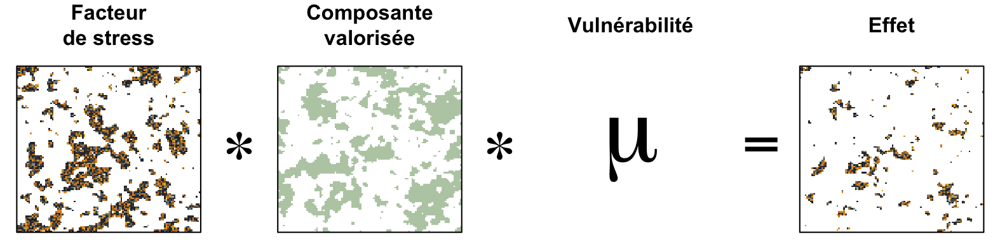

```{r setup, include=FALSE}
source('_setup.R')
# knitr::clean_cache(TRUE)
htmltools::tagList(
  xaringanExtra::use_clipboard(
    button_text = "<i class=\"fa fa-clipboard\"></i>",
    success_text = "<i class=\"fa fa-check\" style=\"color: #37abc8\"></i>",
  ),
  rmarkdown::html_dependency_font_awesome()
)
# xaringanExtra::use_scribble()
```


class: title-slide, middle


# Effets cumulatifs des activités maritimes sur le Saint-Laurent et la rivière Saguenay - Projet pilote

## Webinaire d'avancement


.instructors[
  David Beauchesne, Cindy Grant & Philippe Archambault
]

<a href="https://www.ulaval.ca/"></img></a>
&nbsp;&nbsp;&nbsp;&nbsp;&nbsp;
</img>

---


class: inverse, center, middle

# Équipe de travail

<html><div style='float:left'></div><hr color='#ffdd55' style="margin-top:-30px" size=1px width=720px></html>

---

# Équipe de travail

<br/>

<center>
<div class="divTable team">
<div class="divTableBody">
<div class="divTableRow">
<div class="divTableCell">

</div><div class="divTableCell">

</div><div class="divTableCell">

</div></div>
<div class="divTableRow">
<div class="divTableCell"><b>David Beauchesne</b></div><div class="divTableCell"><b>Cindy Grant</b></div><div class="divTableCell"><b>Philippe Archambault</b></div></div>
</div>
</center>


---

class: inverse, center, middle

# Évaluation des effets cumulatifs

<html><div style='float:left'></div><hr color='#ffdd55' style="margin-top:-30px" size=1px width=720px></html>

---


# Évaluation des effets cumulatifs

.references[
Loi canadienne sur l'évaluation environnementale (1992)
]

**Évaluation d'impact** : *Évaluation des effets d’un projet désigné effectuée conformément à la Loi sur l’évaluation d’impact (Canada).‍ Ou Évaluation de tout projet encadré par la procédure d’évaluation et d’examen des impacts sur l’environnement prévue en vertu de la Loi sur la qualité de l’environnement (Québec).‍*

--

**Effets cumulatifs** : *[...] les effets cumulatifs que [la] réalisation [d’un projet], combinée à l’existence d’autres ouvrages ou à la réalisation d’autres projets ou activités, est susceptible de causer à l’environnement*.

--

**Évaluation des effets cumulatifs** : *procédure systématique qui vise à identifier, à analyser et à évaluer les effets cumulatifs.*

<!--
https://www.parl.ca/DocumentViewer/fr/42-1/projet-loi/C-69/sanction-royal
https://www.canada.ca/fr/agence-evaluation-impact/services/politiques-et-orientation/evaluation-regionale-la-loi-evaluation-impact.html
-->


---

# Évaluation des effets cumulatifs

**Stresseurs environnementaux** : *Tout élément physique, chimique ou biologique qui, à un niveau d'intensité donné, est susceptible d'avoir des effets négatifs sur une composante valorisée.*

--

**Composantes valorisées** : *Éléments sur lesquels l'analyse d'effet cumulatif est effectuée et ayant été estimés préoccupants par les parties prenantes d'un projet.*


---

class: inverse, center, middle

# Étapes

<html><div style='float:left'></div><hr color='#ffdd55' style="margin-top:-30px" size=1px width=720px></html>

---

# Étapes

1. Identifier, impliquer et communiquer avec les parties prenantes de l’évaluation

--
2. Portée de l’évaluation <!-- (objectifs, limites, activités, facteurs de stress, composantes valorisées) -->

--
3. Portrait de la zone à l'étude
    * Activités et facteurs de stress
    * Composantes valorisées
    * Vulnérabilité
--
4. Analyse des effets cumulatifs

--
5. Diagnostic de l'analyse

--
6. Processus décisionnels et de gestion

---

# Étapes

1. **<span style="color:#c13319;">Identifier, impliquer et communiquer avec les parties prenantes de l’évaluation</span>**
2. Portée de l’évaluation
3. Portrait de la zone à l'étude
    * Activités et facteurs de stress
    * Composantes valorisées
    * Vulnérabilité
4. Analyse des effets cumulatifs
5. Diagnostic de l'analyse
6. Processus décisionnels et de gestion
7. Suivi et gestion adaptative

<p style="font-size:17px; line-height:1.4">
<i class="fas fa-arrow-circle-right" style="color:#c13319;"></i> Tout au long du processus
</p>


---

# Étapes

1. <span style="color:#c13319;">Identifier, impliquer et communiquer avec les parties prenantes de l’évaluation</span>
2. **<span style="color:#1989c1;">Portée de l’évaluation</span>**
3. Portrait de la zone à l'étude
    * Activités et facteurs de stress
    * Composantes valorisées
    * Vulnérabilité
4. Analyse des effets cumulatifs
5. Diagnostic de l'analyse
6. Processus décisionnels et de gestion
7. Suivi et gestion adaptative

<p style="font-size:17px; line-height:1.4">
<i class="fas fa-arrow-circle-right" style="color:#c13319;"></i> Tout au long du processus <br/>
<i class="fas fa-arrow-circle-right" style="color:#1989c1;"></i> Préalablement identifié
</p>

---

# Étapes

1. <span style="color:#c13319;">Identifier, impliquer et communiquer avec les parties prenantes de l’évaluation</span>
2. <span style="color:#1989c1;">Portée de l’évaluation</span>
3. **<span style="color:#FECA2C;">Portrait de la zone à l'étude</span>**
    * **<span style="color:#FECA2C;">Activités et facteurs de stress</span>**
    * **<span style="color:#FECA2C;">Composantes valorisées</span>**
    * **<span style="color:#FECA2C;">Vulnérabilité</span>**
4. **<span style="color:#FECA2C;">Analyse des effets cumulatifs</span>**
5. **<span style="color:#FECA2C;">Diagnostic de l'analyse</span>**
6. Processus décisionnels et de gestion
7. Suivi et gestion adaptative

<p style="font-size:17px; line-height:1.4">
<i class="fas fa-arrow-circle-right" style="color:#c13319;"></i> Tout au long du processus<br/>
<i class="fas fa-arrow-circle-right" style="color:#1989c1;"></i> Préalablement identifié<br/>
<i class="fas fa-arrow-circle-right" style="color:#FECA2C;"></i> Travail effectué par notre équipe
</p>


---

# Étapes

1. <span style="color:#c13319;">Identifier, impliquer et communiquer avec les parties prenantes de l’évaluation</span>
2. <span style="color:#1989c1;">Portée de l’évaluation</span>
3. <span style="color:#FECA2C;">Portrait de la zone à l'étude</span>
    * <span style="color:#FECA2C;">Activités et facteurs de stress</span>
    * <span style="color:#FECA2C;">Composantes valorisées</span>
    * <span style="color:#FECA2C;">Vulnérabilité</span>
4. <span style="color:#FECA2C;">Analyse des effets cumulatifs</span>
5. <span style="color:#FECA2C;">Diagnostic de l'analyse</span>
6. **<span style="color:#999999;">Processus décisionnels et de gestion</span>**
7. **<span style="color:#999999;">Suivi et gestion adaptative</span>**

<p style="font-size:17px; line-height:1.4">
<i class="fas fa-arrow-circle-right" style="color:#c13319;"></i> Tout au long du processus<br/>
<i class="fas fa-arrow-circle-right" style="color:#1989c1;"></i> Préalablement identifié<br/>
<i class="fas fa-arrow-circle-right" style="color:#FECA2C;"></i> Travail effectué par notre équipe<br/>
<i class="fas fa-arrow-circle-right" style="color:#999999;"></i> Étapes non-incluses au contrat
</p>

---

# Étapes

1. <span style="color:#c13319;">Identifier, impliquer et communiquer avec les parties prenantes de l’évaluation</span>
2. <span style="color:#1989c1;">Portée de l’évaluation</span>
3. **<span style="color:#429a6d;">Portrait de la zone à l'étude</span>**
    * **<span style="color:#429a6d;">Activités et facteurs de stress</span>**
    * **<span style="color:#429a6d;">Composantes valorisées</span>**
    * <span style="color:#FECA2C;">Vulnérabilité</span>
4. <span style="color:#FECA2C;">Analyse des effets cumulatifs</span>
5. <span style="color:#FECA2C;">Diagnostic de l'analyse</span>
6. Processus décisionnels et de gestion
7. Suivi et gestion adaptative

<p style="font-size:17px; line-height:1.4">
<i class="fas fa-arrow-circle-right" style="color:#c13319;"></i> Tout au long du processus<br/>
<i class="fas fa-arrow-circle-right" style="color:#1989c1;"></i> Préalablement identifié<br/>
<i class="fas fa-arrow-circle-right" style="color:#FECA2C;"></i> Travail effectué par notre équipe<br/>
<i class="fas fa-arrow-circle-right" style="color:#999999;"></i> Étapes non-incluses au contrat<br/><br/>
<i class="fas fa-arrow-circle-right" style="color:#429a6d;"></i> Webinaire d'avancement (aujourd'hui)<br/>
</p>

---

class: inverse, center, middle

# Portée de l'évaluation

<html><div style='float:left'></div><hr color='#ffdd55' style="margin-top:-30px" size=1px width=720px></html>


---

# Portée de l'évaluation

## Zone d'étude <a href="maps/sa.html" target="_blank">`r mp()`</a>


### Étendue

- Ouest: Châteaugay
- Est : Pointe-des-Monts et Cap-Chat
- Saguenay : Saint-Fulgence

### Grille d'étude

- Cellules $1km^2$

---

# Portée de l'évaluation

## Stresseurs environnementaux & composantes valorisées

<br/>

<center></img></center>


---

class: inverse, center, middle

# Méthode d'analyse

<html><div style='float:left'></div><hr color='#ffdd55' style="margin-top:-30px" size=1px width=720px></html>

## Court rappel

---

# Méthode d'analyse

<center></img></center>

.references[
Halpern et al. 2008; Halpern et al. 2015
]


---

# Méthode d'analyse


<center></img></center>


.references[
Halpern et al. 2008; Halpern et al. 2015
]

---

# Méthode d'analyse

<br/><br/>

<center></img></center>

.references[
Halpern et al. 2008; Halpern et al. 2015
]

---

# Méthode d'analyse

<center></img></center>

.references[
Halpern et al. 2008; Halpern et al. 2015
]

---

# Méthode d'analyse

<center></img></center>

.references[
Halpern et al. 2008; Halpern et al. 2015
]

---


# Méthode d'analyse


<center></img></center>

.references[
Beauchesne et al., en préparation
]


---

class: inverse, center, middle

# Merci de votre attention!

<html><div style='float:left'></div><hr color='#ffdd55' style="margin-top:-30px" size=1px width=720px></html>


<!--
rmarkdown::render('./index.Rmd')
xaringan::decktape("https://effetscumulatifsnavigation.github.io/WebinaireMethode", "Webinaire.pdf", docker = FALSE)
-->
